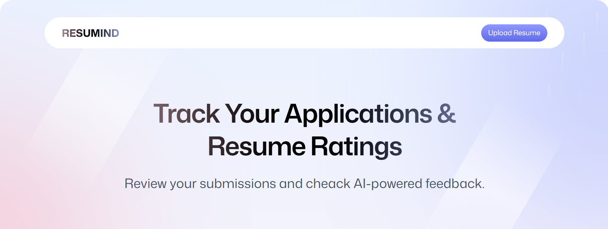

   
    
   

  

    
    
    
    
  

  <h3 align="center">AI Resume Analyzer</h3>

  

    Build an AI-powered Resume Analyzer with <b>React</b>, <b>React Router</b>, and <b>Puter.js</b>.  
    Upload and store resumes, match candidates to jobs, and get AI-driven ATS scores and custom feedback.
  

---

## ✨ Introduction

This project allows users to upload resumes, securely store them, and get **AI-powered analysis** for job applications.  
It provides ATS scores, job matching, and tailored improvement feedback in a clean, reusable UI.

---

## ⚙️ Tech Stack

- **React** – Frontend framework  
- **React Router** – Routing and navigation  
- **Puter.js** – Serverless auth, storage, and AI integration  
- **Tailwind CSS** – Utility-first CSS framework  
- **TypeScript** – Strong typing and maintainability  
- **Vite** – Fast build tool and dev server  
